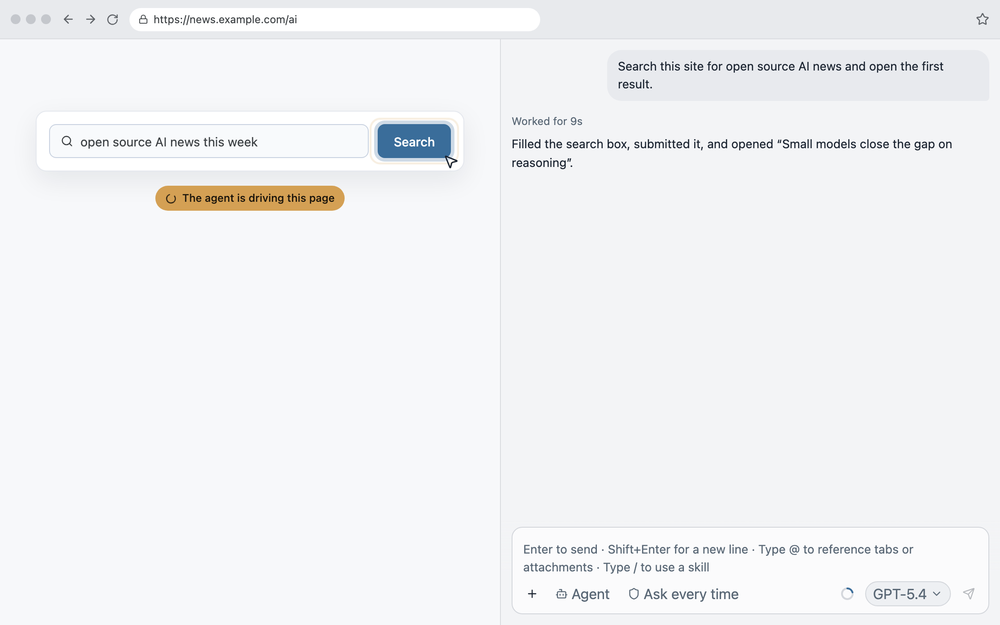
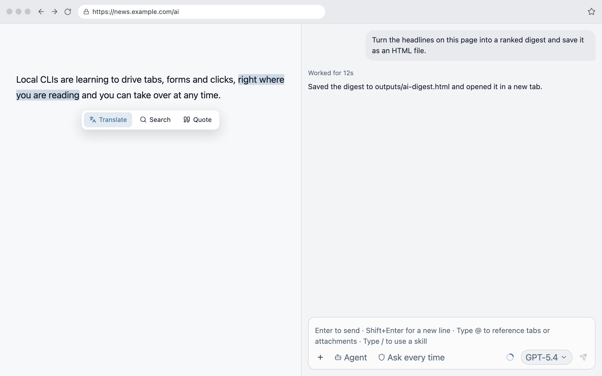
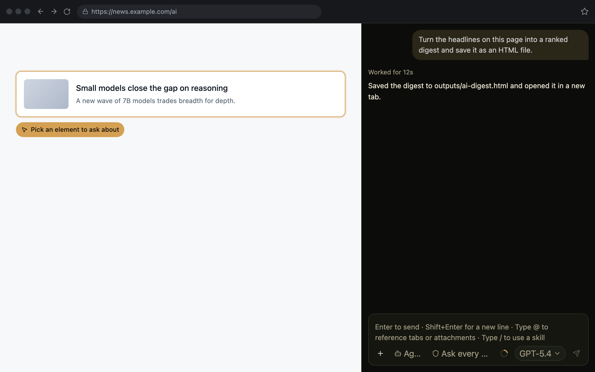

<div align="center">
  <br />
  
  <p>
    Give your browser AI wings
  </p>
  <p>
    <a href="https://github.com/parksben/opensider/releases/latest"></a>
    <a href="./LICENSE"></a>
  </p>
</div>

<div align="center">
  English | <a href="./README_ZH.md">中文</a>
</div>

<br />

OpenSider drives the local Agent CLIs you already use — Claude Code, Codex, OpenCode, Cursor and other [ACP](https://agentclientprotocol.com) agents — from a side panel in your browser. It works on the page you are looking at: reading it, clicking it, filling it, and taking screenshots, with the login and form state that is already there. Nothing is uploaded.

## Highlights

- **The Agent lives in your side panel.** Chat with your local CLI without switching to a terminal.
- **Your browser, exactly as it is.** Your logged-in sessions and anything you have already filled in are reused, so the scene is never reconstructed.
- **The page is the context.** The Agent automatically gets the tab you are on; there is nothing to point it at.
- **Automation you can watch.** Navigation, reading, clicking, form filling and screenshots are injected into the Agent as tools, and they run live on the page.
- **Quote, translate, search.** Select text and use the toolbar; the result comes back in the side panel.
- **Pick an element.** Point at one element on the page and ask about it.

## Demo

### Automate the page

Ask in the side panel and the Agent works the page in front of you — navigating, clicking, filling fields and taking screenshots, live. You can take over at any time.



### Quote, translate, search

Select text on any page, then translate it, search it, or quote it into the composer.



### Pick an element

Pick one element — a card, a button, an input — and ask about it directly.



## Install & Use

### 1. Install

> This extension is for Chromium-based browsers such as Chrome / Edge / Brave. Before installing, make sure you already have a running Agent CLI program on your machine.

One-step install: paste the prompt below into the local AI Agent you already use (Claude Code, Codex, OpenCode, Cursor, …). It will prepare your local environment and walk you through installing the browser extension.

```
Install the OpenSider browser extension for me.
Read https://raw.githubusercontent.com/parksben/opensider/main/skills/opensider/SKILL.md and follow its install flow.
```

### 2. Update

One-step update: when the side panel tells you a new version is available, copy the prompt below to your local Agent and let it guide you through the update.

```
Update the OpenSider browser extension for me.
Read https://raw.githubusercontent.com/parksben/opensider/main/skills/opensider/SKILL.md and follow its update flow.
```

### 3. Uninstall

One-step uninstall: one prompt is all it takes, and you choose whether to keep or remove your local data.

```
Uninstall the OpenSider browser extension for me.
Read https://raw.githubusercontent.com/parksben/opensider/main/skills/opensider/SKILL.md and follow its removal flow.
```

## Workspace & Local Data

OpenSider never uploads your configuration or chats to any server: all sessions and Agent artifacts live on this machine under `~/.opensider`, and they stay usable after uninstalling or reinstalling the extension.

| File / folder | What it holds |
|---|---|
| `~/.opensider/workspace/` | The Agent's working directory: every tab and every session works in this same folder |
| `~/.opensider/workspace/browser/` | Scratch files produced during a session, such as the current page snapshot, interactive controls, page commands and results, screenshots |
| `~/.opensider/workspace/outputs/` | Artifacts the Agent produces during a session (tables, documents, code, …) |
| `~/.opensider/ui-state.json` | Session list and preferences |
| `~/.opensider/sessions/<id>.json` | That session's messages |
| `~/.opensider/runtime/` | The local bridge binary, plus the Claude Code / Codex ACP adapters |
| `~/.opensider/host.log` | Bridge log — the Agent can use it to debug problems. Rotated by size and by date, keeping the last few files as `host.log.<timestamp>` |
| The extension folder you picked at install (suggested `~/OpenSider/`) | The folder the browser actually loads — **do not move or delete it**, or the extension breaks |

On Windows these live under `%USERPROFILE%\.opensider` and `%USERPROFILE%\OpenSider`.

## FAQ

### Why does OpenSider support Agent CLIs, but not desktop Agent apps?

OpenSider is itself an Agent client: its local bridge starts an Agent process and uses ACP to carry sessions, streaming responses, tool calls, and permission requests. A compatible Agent therefore needs a CLI that speaks ACP directly or through an adapter.

Desktop apps such as Claude and Codex keep their runtime behind their own UI and do not expose a stable ACP process endpoint for OpenSider to start and control. Automating their windows would be brittle and could not preserve the full protocol behavior, so the desktop apps themselves are not supported. Their corresponding CLIs can still be used when they provide ACP or have a compatible adapter.

To connect a supported Agent product:

1. Visit the product's official website and find its official Agent CLI.
2. Follow the official instructions to install the CLI and sign in.
3. Run the OpenSider installation prompt above again. OpenSider will detect the CLI and configure any available ACP integration.

For example:

- **Claude Code:** install and sign in to [Claude Code CLI](https://docs.claude.com/en/docs/claude-code/setup), then run the OpenSider installation prompt again.
- **Codex:** install and sign in to [Codex CLI](https://developers.openai.com/codex/cli), then run the OpenSider installation prompt again.

If the product has no Agent CLI, ACP interface, or compatible adapter, OpenSider cannot connect to it yet.

### I installed an Agent CLI. Why can't I select it in the side panel?

Having the CLI installed is not enough by itself: it may lack an ACP entry point or adapter, be outside the local bridge's PATH, or have an incomplete setup. Send this prompt to the local Agent you already use:

```
Help me diagnose and fix an installed Agent CLI that does not appear in the OpenSider side panel.
First read https://raw.githubusercontent.com/parksben/opensider/main/skills/opensider/SKILL.md, then follow its doctor and repair flow to check the CLI's ACP entry point, launch command, PATH, and required adapter. Fix what can be fixed and verify that it appears in the side panel; if it has no ACP interface or usable adapter, say so clearly.
```
